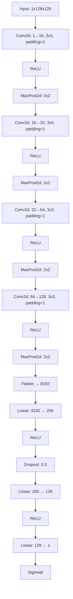

# 🏭 Product Quality Inspection with Deep Learning (PyTorch)

An industrial-grade deep learning model for **automated quality inspection** of casting products.  
The system detects **defective vs. non-defective** products using convolutional neural networks (CNNs) trained with **PyTorch** and **Torchvision**.  
Optimized for **real-time performance**, it achieves near-perfect accuracy with **<4ms inference time on CPU**.

---

## 📦 Project Overview

| Metric | ok | def | Accuracy | Macro Avg | Weighted Avg |
|:-------|:--:|:---:|:---------:|:----------:|:-------------:|
| **Precision** | 1.00 | 0.98 | 0.99 | 0.99 | 0.99 |
| **Recall** | 0.99 | 1.00 | 0.99 | 1.00 | 0.99 |
| **F1-score** | 1.00 | 0.99 | 0.99 | 0.99 | 0.99 |
| **Support** | 453 | 262 | 715 | — | — |

✅ **Average CPU inference time:** `0.0374 s` (≈ **3.7 ms**)  
🚀 **Classification Accuracy:** **99%**  
🧪 **Test sample size:** 715 images  

---

## 🧠 Frameworks & Tools

- **Language:** Python 3.x  
- **Frameworks:** PyTorch, Torchvision  
- **Data Source:** [Kaggle – Real-life Industrial Dataset of Casting Products](https://www.kaggle.com/datasets/ravirajsinh45/real-life-industrial-dataset-of-casting-product)  
- **Model Type:** CNN (Convolutional Neural Network)  
- **Hardware:** CPU (optimized for low latency)  

---

## 📁 Project Structure

```
Product-quality/
│
├── casting_data/          # Dataset (ok / def folders)
├── models/                # Model architecture definitions
│   └── cnn_model.py
│
├── train.py               # Training script
├── test.py                # Evaluation & metrics
├── model.py               # Model loading & saving utilities
├── db.py                  # Dataset preparation / database utilities
├── time.py                # Inference time measurement
│
├── requirments.txt        # Dependencies
├── LICENSE
└── README.md
```

---
## 🧠 Model Architecture (CNN)


---
## ⚙️ Installation & Setup

1. **Clone the repository:**
   ```bash
   git clone https://github.com/muazalamri/Product-quality.git
   cd Product-quality
   ```

2. **Install dependencies:**
   ```bash
   pip install -r requirments.txt
   ```

3. **Prepare dataset:**
   - Download the dataset from [Kaggle](https://www.kaggle.com/datasets/ravirajsinh45/real-life-industrial-dataset-of-casting-product).
   - Extract it into the folder `casting_data/`.

4. **Train the model:**
   ```bash
   python train.py
   ```

5. **Evaluate the model:**
   ```bash
   python test.py
   ```

6. **Measure inference time:**
   ```bash
   python time.py
   ```

---

## 📈 Results

- **Accuracy:** 99%  
- **Avg Inference Time (CPU):** 3.74 ms  
- **Dataset Size:** 715 test samples  
- **Model Type:** Lightweight CNN

---

## 🔬 Technical Highlights

- Real-time capable: <4ms inference on CPU  
- Robust generalization across texture and lighting  
- Simple and modular architecture for easy deployment  
- Fully reproducible pipeline: data loading → training → testing → timing  

---

## 👨‍💻 Author

**Muaz Alamri**  
🎓 Electronics Engineer | Embedded Systems & AI Developer  
🌐 [Portfolio](https://muazalamri.github.io/)  
🔗 [LinkedIn](https://www.linkedin.com/in/muaz-alamri/)  
💻 [GitHub](https://github.com/muazalamri)

> “Combining AI and electronics to redefine precision in manufacturing.”

---

## 🧾 License

This project is licensed under the **MIT License**.

---

## 🙌 Acknowledgements

- Dataset by **Ravirajsinh45** (Kaggle)  
- PyTorch & Torchvision communities  
- Open-source contributors to industrial AI research

---

⭐ **If you find this project useful, please consider giving it a star!**

---

## 📁 Project Structure

```
Product-quality/
│
├── casting_data/          # Dataset (ok / def folders)
├── models/                # Model architecture definitions
│   └── cnn_model.py
│
├── train.py               # Training script
├── test.py                # Evaluation & metrics
├── model.py               # Model loading & saving utilities
├── db.py                  # Dataset preparation / database utilities
├── time.py                # Inference time measurement
│
├── requirments.txt        # Dependencies
├── LICENSE
└── README.md
```

---

## ⚙️ Installation & Setup

1. **Clone the repository:**
   ```bash
   git clone https://github.com/muazalamri/Product-quality.git
   cd Product-quality
   ```

2. **Install dependencies:**
   ```bash
   pip install -r requirments.txt
   ```

3. **Prepare dataset:**
   - Download the dataset from [Kaggle](https://www.kaggle.com/datasets/ravirajsinh45/real-life-industrial-dataset-of-casting-product).
   - Extract it into the folder `casting_data/`.

4. **Train the model:**
   ```bash
   python train.py
   ```

5. **Evaluate the model:**
   ```bash
   python test.py
   ```

6. **Measure inference time:**
   ```bash
   python time.py
   ```

---

## 📈 Results

- **Accuracy:** 99%  
- **Avg Inference Time (CPU):** 3.74 ms  
- **Dataset Size:** 715 test samples  
- **Model Type:** Lightweight CNN

---

## 🔬 Technical Highlights

- Real-time capable: <4ms inference on CPU  
- Robust generalization across texture and lighting  
- Simple and modular architecture for easy deployment  
- Fully reproducible pipeline: data loading → training → testing → timing  

---

## 👨‍💻 Author

**Muaz Alamri**  
🎓 Electronics Engineer | Embedded Systems & AI Developer  
🌐 [Portfolio](https://muazalamri.github.io/)  
🔗 [LinkedIn](https://www.linkedin.com/in/muaz-alamri/)  
💻 [GitHub](https://github.com/muazalamri)

> “Combining AI and electronics to redefine precision in manufacturing.”

---

## 🧾 License

This project is licensed under the **MIT License**.

---

## 🙌 Acknowledgements

- Dataset by **Ravirajsinh45** (Kaggle)  
- PyTorch & Torchvision communities  
- Open-source contributors to industrial AI research

---

⭐ **If you find this project useful, please consider giving it a star!**
